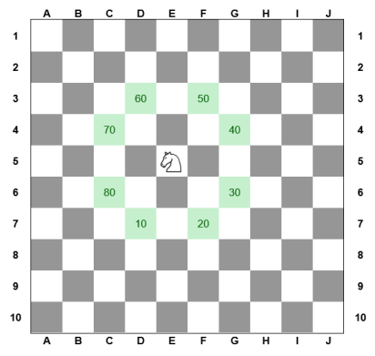

# Manual Técnico da 1ª Fase do Projeto - Época Normal

<p align="center">
  
</p>


## Inteligência Artificial - Escola Superior de Tecnologia de Setúbal 2023/2024

Prof. Joaquim Filipe

Eng. Filipe Mariano

# Jogo do Cavalo

Realizado por:

João Silva - 202100233

Nuno Jesus - 202100238

18 de dezembro de 2023

# Índice

1. Introdução
2. Arquitetura do Sistema
3. Entidades e sua implementação
4. Algoritmos e sua implementação
5. Resultados dos Algoritmos
6. Limitações técnicas e ideias para desenvolvimento futuro

# 1. Introdução

Este Manual Técnico é uma ferramenta essencial projetada especificamente para técnicos que não estiveram diretamente envolvidos no desenvolvimento do Projeto "Jogo do Cavalo". Foi redigido com a precisão e detalhamento necessários para um entendimento técnico profundo, este documento oferece uma visão exaustiva das especificidades técnicas e decisões de desenvolvimento do software do jogo. O objetivo primordial é equipar os técnicos com conhecimentos aprofundados sobre as complexidades do projeto, permitindo-lhes assim, continuar o desenvolvimento ou realizar ajustes e melhorias conforme necessário.

# 2. Arquitetura do Sistema

O "Jogo do Cavalo" foi implementado em LISP, tendo sido desenvolvido com o auxílio do IDE LispWorks. A estrutura do projeto é formada por 4 ficheiros:

* projeto.lisp - Responsável pela interação com o utilizador, escrita e leitura de ficheiros;
* puzzle.lisp - Implementação da resolução do problema, incluindo seletores, operadores heurísticos e outras funções auxiliares;
* procura.lisp - Implementação dos algoritmos BFS, DFS e A*;
* problemas.dat - Funções com os problemas de A) a F), previamente definidos.

 Visto que a estrutura do projeto é composta por 4 ficheiros distintos, para cada máquina temos de configurar o path ou o caminho da diretoria desses ficheiros então a alteração a realizar deverá alterar o *path* no ficheiro Projeto.lisp.

```Lisp
(defun diretoria-atual ()
"Estabelece o caminho até aos ficheiros do projeto a partir do diretório raiz"
  (let ((path "C:\\Path\\"))
    path
  )
)

(defun ficheiro-solucao ()
(let ((path  "C:\\Path\\solucao.dat"))
    path
  )
)
```

Após a configuração do caminho, deve-se abrir o LispWorks, seguidamente abrir o ficheiro Projeto.Lisp e compilar o mesmo.

# 3. Entidades e sua implementação

Neste capítulo, detalhamos as entidades-chave do "Jogo do Cavalo" e sua implementação programática. É importante fazer a distinção entre as entidades do domínio de aplicação (as que o jogador percebe) e as entidades programáticas (como são representadas e manipuladas no código).

## Tabuleiro

No contexto deste projeto, são apresentados seis tabuleiros distintos, identificados de A) até F), especificado no ficheiro "problemas.dat". Estes tabuleiros variam em termos de configuração e complexidade.

Ao contrário dos tabuleiros A) até E), onde a disposição dos átomos segue um padrão predeterminado, o tabuleiro F caracteriza-se pela alocação aleatória e não repetitiva destes átomos. Esta abordagem garante que cada instância do problema F) ofereça uma experiência única e imprevisível.

### Domínio da aplicação

* No domínio do jogo, o tabuleiro é o espaço onde o jogo se desenrola. É visualizado como uma grelha, similar a um tabuleiro de xadrez.

### Entidade pragmática

* Programaticamente, o tabuleiro é representado por uma lista composta por 10 sublistas. Cada sublista representa uma linha do tabuleiro, contendo elementos que simbolizam as casas. Esta estrutura de dados foi escolhida pela sua eficiência na representação de um espaço bidimensional e facilidade de acesso aos elementos individuais (as casas do tabuleiro).

## Cavalo

O cavalo, no contexto do "Jogo do Cavalo", não é apenas uma peça no tabuleiro, mas sim o elemento central em torno do qual toda a dinâmica do jogo se desenvolve. Inspirado na peça do xadrez, o cavalo neste jogo adquire um papel singular, desempenhando uma função crucial tanto na estratégia quanto na execução do jogo.

Nesta seção, exploraremos em detalhe não só o papel do cavalo no domínio do jogo, mas também sua implementação técnica, desvendando como esta peça é representada e controlada no código do jogo. Esta dupla perspectiva visa oferecer uma compreensão completa tanto da importância estratégica do cavalo no jogo como da sua representação e manipulação na estrutura do software.

### Domínio de Aplicação

* No jogo, o cavalo é a peça principal movimentada pelo jogador. O seu comportamento e a sua movimentação são inspirados no cavalo do xadrez, podendo mover-se em 'L' - duas casas numa direção e uma noutra perpendicular.

### Entidade Programática

* O cavalo é representado programaticamente pelo caráter 'T'. A sua posição no tabuleiro é controlada através de coordenadas que correspondem às posições nas sublistas do tabuleiro. A lógica de movimentação segue as regras do xadrez para o movimento do cavalo, e esta é implementada através de funções que verificam e atualizam a posição do 'T' no tabuleiro, mantendo a integridade do movimento e as regras do jogo.

## Regra do simétrico

A "Regra do simétrico" é aplicada imediatamente após cada movimento do cavalo. Esta regra determina que o valor simétrico à casa recém-ocupada pelo cavalo se torna automaticamente indisponível para movimentos futuros. Por exemplo, se o cavalo se move para uma casa de valor '15', a casa de valor '51' no tabuleiro torna-se indisponível (marcada como 'Nil').

### Implementação e Impacto no Jogo

* Esta regra requer um cálculo constante dos valores simétricos no tabuleiro após cada movimento do cavalo. É uma regra que adiciona uma camada de planeamento antecipatório, pois os jogadores devem considerar não apenas os movimentos imediatos, mas também como esses movimentos terão impacto nas opções futuras.

## Regra do número duplo

A "Regra do número duplo" é aplicada quando o cavalo se move para uma casa cujo valor é um número duplo (por exemplo, 22, 44, etc.). Neste caso, a casa com o maior número duplo ainda disponível no tabuleiro torna-se automaticamente indisponível para movimentos futuros.

### Implementação e Impacto no Jogo

* Esta regra demanda que os jogadores e o sistema de jogo mantenham um registo dos números duplos disponíveis no tabuleiro. Quando ativada, a regra remove estrategicamente uma opção de movimento, muitas vezes crítica, do tabuleiro. Isso obriga os jogadores a ponderarem cuidadosamente a escolha de mover-se para números duplos, equilibrando o ganho imediato com as possíveis restrições futuras.

## Movimentação do Cavalo

A movimentação do cavalo  é um dos aspectos mais críticos do jogo, exigindo um entendimento claro das regras de movimento e da implementação programática. A inicialização do cavalo no tabuleiro é o primeiro passo para definir a dinâmica do jogo. 

### Inicialização do Cavalo

O cavalo apenas pode ser colocado na primeira linha, se não for indicada a coluna, o cavalo é inicializado na primeira coluna da primeira linha. A posição do cavalo é fundamental para o desenrolar do jogo, influenciando as estratégias e movimentos possíveis.

```Lisp
(defun inicializar-cavalo (tabuleiro &optional (coluna 0))
  "Coloca o cavalo na posição [0, coluna] de uma cópia do tabuleiro, onde coluna é opcional e deve ser entre 0 e 10."
  (let ((novo-tabuleiro (limpar-cavalos (copy-list tabuleiro)))) ; Cria uma cópia do tabuleiro e remove os cavalos existentes
    (cond
      ((or (< coluna 0) (> coluna 10)) ; Se a coluna é inválida
       (setq coluna 0)) ; Ajusta para 0
      (t
       (setf (nth coluna (car novo-tabuleiro)) 'T))) ; Coloca o cavalo na posição especificada no novo tabuleiro
    novo-tabuleiro)) ; Retorna o novo tabuleiro
```

### Implementação da Movimentação

A movimentação do cavalo é implementada por meio de funções específicas em Lisp, as quais permitem a execução de movimentos válidos de acordo com as regras do jogo. Estas funções lidam com a lógica de movimentação, verificação de movimentos válidos e aplicação das regras do jogo, como a regra do simétrico e a regra do duplo.

Os operadores representam os movimentos possíveis num determinado estado. Para o Problema do Cavalo o
máximo de movimentos possíveis serão 8, desde que essas casas não tenham sido ainda visitadas ou
removidas pela regra dos simétricos ou duplos.

<p align="center">
  
</p>


O número de movimentos para
solucionar este puzzle é fixo (8 movimentos), e como tal optámos por utilizar uma lista de operadores com os oito operadores.
Por uma questão de uniformização da numeração do operador e qual o movimento que representa, vamos considerar que de acordo com a figura anterior o operador-1 faz o movimento para a casa de valor 10, o operador-2 para a casa de valor 20, etc.

```Lisp
(defun lista-operadores ()
  "Cria uma lista com todos os operadores."
  (list 'operador-1 
        'operador-2 
        'operador-3 
        'operador-4 
        'operador-5 
        'operador-6 
        'operador-7 
        'operador-8)
)
```

```Lisp
(defun escolhe-operador (tabuleiro numero-operador)
  (if (or (< numero-operador 1) (> numero-operador 8))
      (format t "Número do operador inválido. Deve ser entre 1 e 8.~%")
      (cond
        ((= numero-operador 1) (operador-geral tabuleiro 2 -1))
        ((= numero-operador 2) (operador-geral tabuleiro 2 +1))
        ((= numero-operador 3) (operador-geral tabuleiro 1 +2))
        ((= numero-operador 4) (operador-geral tabuleiro -1 +2))
        ((= numero-operador 5) (operador-geral tabuleiro -2 +1))
        ((= numero-operador 6) (operador-geral tabuleiro -2 -1))
        ((= numero-operador 7) (operador-geral tabuleiro -1 -2))
        ((= numero-operador 8) (operador-geral tabuleiro 1 -1))
        (t (format t "Operador não implementado.~%")))
   )
)
```

```Lisp
(defun operador-geral (tabuleiro numero-linhas numero-colunas)
  (if (eq (posicao-cavalo tabuleiro) NIL)
      (format t "Cavalo por posicionar.~%")
    (let* 
        (
         (posicao-cavalo-inicio (posicao-cavalo tabuleiro))
         (nova-linha (+ (first posicao-cavalo-inicio) numero-linhas))
         (nova-coluna (+ (second posicao-cavalo-inicio) numero-colunas))
         (posicao-cavalo-final (list nova-linha nova-coluna))
         (movimento-e-valido (movimento-valido nova-linha nova-coluna tabuleiro))
         )
      (if (eq movimento-e-valido NIL)
          (format t "Movimento inválido.~%")
        (let* 
            (
             (simetrico (numero-simetrico (celula nova-linha nova-coluna tabuleiro)))
             (posicao-simetrico (posicao-valor simetrico tabuleiro))
             (e-duplo (numero-duplo (celula nova-linha nova-coluna tabuleiro)))
             (maximo-duplo (maximo-duplo tabuleiro))
             (posicao-duplo (posicao-valor maximo-duplo tabuleiro))
             )
          (cond 
           ((eq e-duplo T)
            (substituir (first posicao-cavalo-final)(second posicao-cavalo-final)
                        (substituir (first posicao-cavalo-inicio) (second posicao-cavalo-inicio)
                                    (substituir (first posicao-duplo)(second posicao-duplo) tabuleiro 
                                                NIL)
                                    NIL)
                        T)
            )
           (T
            (substituir (first posicao-cavalo-final)(second posicao-cavalo-final)
                        (substituir (first posicao-cavalo-inicio) (second posicao-cavalo-inicio)
                                    (substituir (first posicao-simetrico)(second posicao-simetrico) tabuleiro 
                                                NIL)
                                    NIL)
                        T)
            )
           )
          )
        )
      )
    )
)
```

## Nós

Para uma eficaz implementação e análise de estratégias, optamos por representar os movimentos do cavalo através de nós. Esta abordagem é particularmente benéfica quando aplicamos algoritmos de procura e otimização, explicados no próximo capítulo, que são cruciais para desenvolver estratégias avançadas e eficientes no jogo.

### Composição de um nó

TODO ADICIONAR A COMPOSIÇÃO

### Seletores de um nó

TODO ADICIONAR OS SELETORES

## Sucessões

A sucessão de um nó refere-se ao conjunto de todos os movimentos válidos que o cavalo pode realizar a partir da sua posição no tabuleiro. Cada um destes movimentos leva o cavalo a uma nova posição, gerando um novo nó no contexto do jogo. Assim, a sucessão é uma representação crucial de possíveis trajetórias e estratégias que o cavalo pode seguir em sua jornada pelo tabuleiro.

TODO ADICIONAR AS FUNÇÕES DAS SUCESSÕES

# 4. Algoritmos e sua implementação

Cada problema apresentado possui um objetivo de pontos diferente, como antes referido, estabelecendo critérios distintos para o sucesso no jogo. Dada esta variedade de objetivos e a complexidade inerente de cada problema, torna-se essencial a utilização de algoritmos para desenvolver estratégias eficazes e alcançar os objetivos estipulados.

## BFS (Breadth-First Search)

O algoritmo de Procura em Largura (BFS) explora sistematicamente todas as possíveis movimentações do cavalo a partir de uma dada posição. O BFS funciona expandindo sequencialmente todos os nós em um determinado nível, antes de passar para o nível seguinte. Isso garante que o caminho mais curto possível até o objetivo seja encontrado, caso exista.

<p align="center">
  
</p>


### Aplicação no Jogo

* No contexto do jogo, o BFS é ideal para situações onde o objetivo é alcançar uma determinada pontuação ou posição no tabuleiro no menor número de movimentos. Permite mapear todas as rotas possíveis de forma ampla, identificando a solução mais eficiente em termos de número de movimentos.

## DFS (Depth-First Search)

A Procura em Profundidade (DFS) explora as rotas possíveis de forma profunda, seguindo um caminho até o seu limite antes de retroceder e explorar outras alternativas. Este algoritmo é eficaz para mapear todas as trajetórias possíveis que o cavalo pode tomar, embora não garanta a menor sequência de movimentos.

<p align="center">
  
</p>

### Aplicação no Jogo

* No contexto do jogo, o DFS é particularmente útil no jogo para explorar completamente todas as possibilidades de movimento, incluindo aquelas que podem parecer menos óbvias inicialmente. Isso o torna valioso para identificar soluções criativas ou menos diretas para alcançar o objetivo de pontos.

## A* (Best-First Search)

O algoritmo A* é um algortimo de procura que combina as melhores características do BFS e DFS, utilizando heurísticas para priorizar caminhos que parecem mais promissores. É usado para encontrar o caminho mais eficiente para alcançar um objetivo, levando em consideração tanto a distância até o objetivo quanto o custo dos movimentos.

### Aplicação no Jogo

* No contexoto do jogo, o A* é eficaz para encontrar o caminho ótimo que maximiza a pontuação ou atinge uma posição específica com eficiência. O algoritmo ajusta dinamicamente a sua estratégia de procura com base nas condições do tabuleiro e nas regras do jogo, equilibrando a procura por eficiência e eficácia.

## Ordenação

TODO

## Heurísticas

TODO


# 5. Resultados dos Algoritmos

FRM - Fator de ramificação média

## BFS (Breadth-First Search)

| Problema | Pontos | Nós Gerados | Nós Expandidos | Penetrância | *g(x)* Profundidade | FRM |  Tempo de Execução |
| - | :-------:|:--------:|:--------:| :-----:| :---:| :---:| :---:|
| A |   TODO   |  TODO    |  TODO    | TODO   | TODO | TODO | TODO |
| B |   TODO   |  TODO    |  TODO    | TODO   | TODO | TODO | TODO |
| C |   TODO   |  TODO    |  TODO    | TODO   | TODO | TODO | TODO |
| D |   TODO   |  TODO    |  TODO    | TODO   | TODO | TODO | TODO |
| E |   TODO   |  TODO    |  TODO    | TODO   | TODO | TODO | TODO |
| F |   TODO   |  TODO    |  TODO    | TODO   | TODO | TODO | TODO |

## DFS (Depth-First Search)

Usando profundidade x

| Problema | Pontos | Nós Gerados | Nós Expandidos | Penetrância | *g(x)* Profundidade | FRM |  Tempo de Execução |
| - | :-------:|:--------:|:--------:| :-----:| :---:| :---:| :---:|
| A |   TODO   |  TODO    |  TODO    | TODO   | TODO | TODO | TODO |
| B |   TODO   |  TODO    |  TODO    | TODO   | TODO | TODO | TODO |
| C |   TODO   |  TODO    |  TODO    | TODO   | TODO | TODO | TODO |
| D |   TODO   |  TODO    |  TODO    | TODO   | TODO | TODO | TODO |
| E |   TODO   |  TODO    |  TODO    | TODO   | TODO | TODO | TODO |
| F |   TODO   |  TODO    |  TODO    | TODO   | TODO | TODO | TODO |

## A* (Best-First Search)

| Problema | Pontos | Nós Gerados | Nós Expandidos | Penetrância | *g(x)* Profundidade | Heurística *h(x)* | FRM |  Tempo de Execução |
| - | :-------:|:--------:|:--------:| :-----:| :---:| :---:| :---:| :---:|
| A |   TODO   |  TODO    |  TODO    | TODO   | TODO | TODO | TODO | TODO |
| B |   TODO   |  TODO    |  TODO    | TODO   | TODO | TODO | TODO | TODO |
| C |   TODO   |  TODO    |  TODO    | TODO   | TODO | TODO | TODO | TODO |
| D |   TODO   |  TODO    |  TODO    | TODO   | TODO | TODO | TODO | TODO |
| E |   TODO   |  TODO    |  TODO    | TODO   | TODO | TODO | TODO | TODO |
| F |   TODO   |  TODO    |  TODO    | TODO   | TODO | TODO | TODO | TODO |

# 6. Limitações técnicas e ideias para desenvolvimento futuro

TODO LIMITAÇÕES E IDEIAS FUTURAS